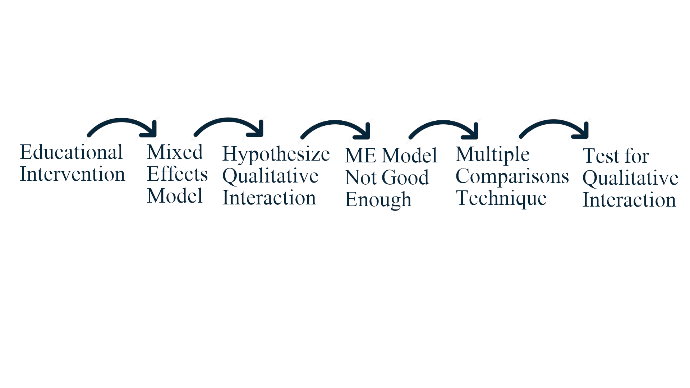
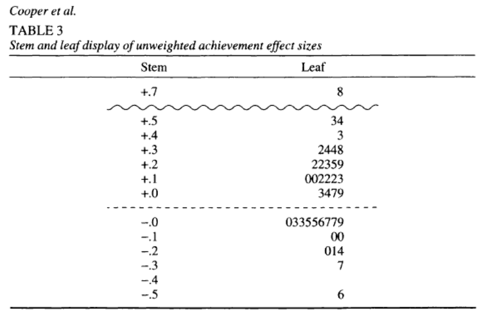
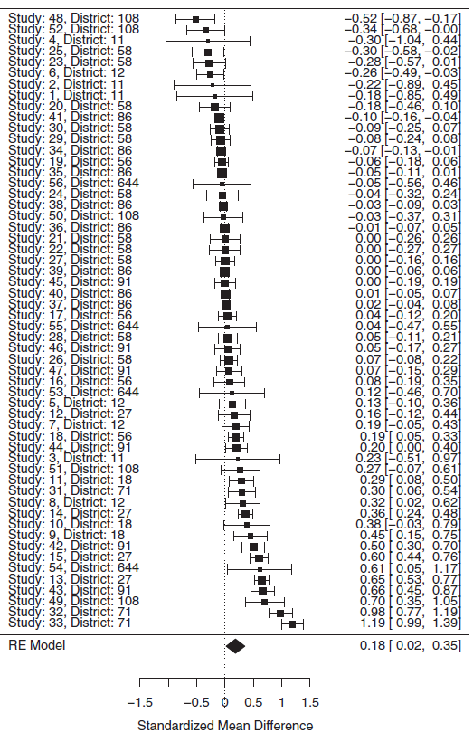
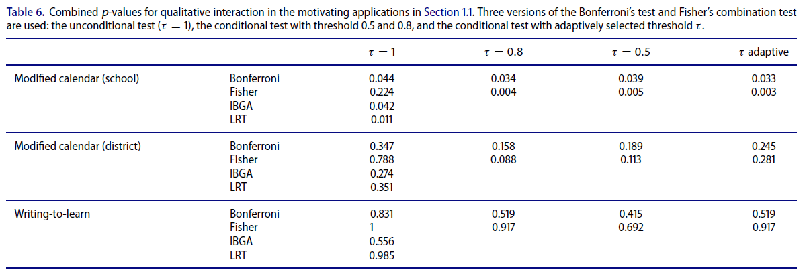
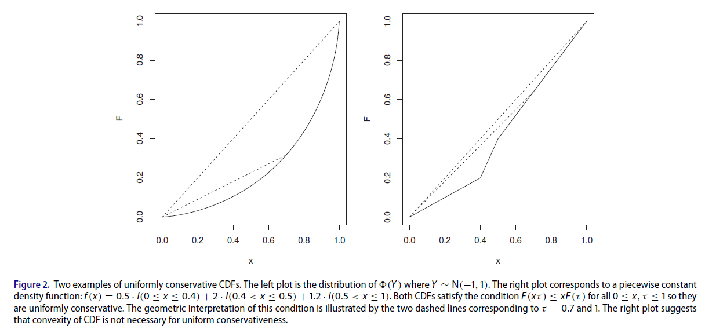
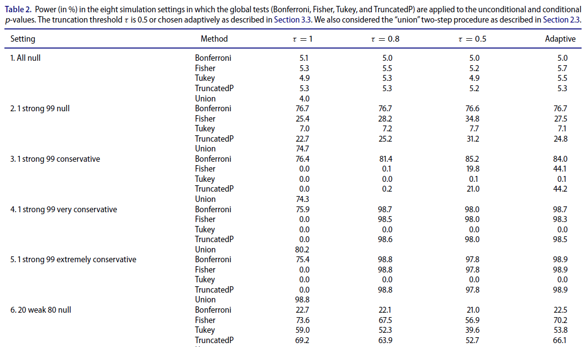
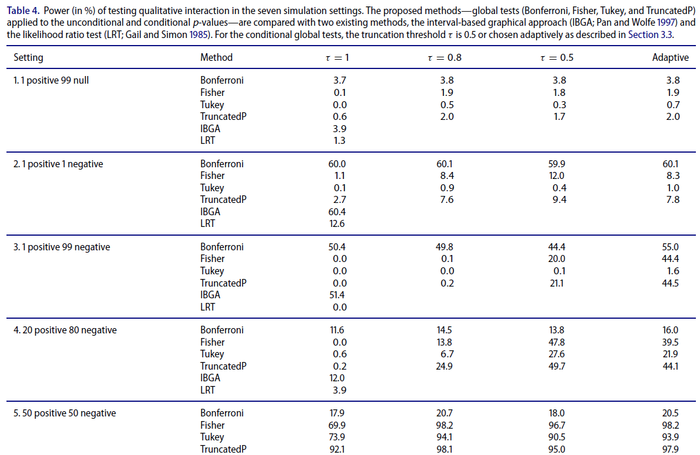

class: title-slide

## Multiple Testing When Many P-Values are Uniformly Conservative

#### Qingyuan Zhao, Dylan S. Small, and Weijie Su (2019)

##### Presented by: Giora Simchoni

### Multiple Comparisons and Selective Inference Sem. A 2020

#### Stat. and OR Department, TAU
#### 2020-11-05

---
```{r child = "setup.Rmd"}
```

```{r packages, echo=FALSE, message=FALSE, warning=FALSE}
library(tidyverse)
```

class: section-slide

# At Highest Level

---

## There's a Story

.no_shadow[
<center></center>
]

---

class: section-slide

# Motivation

---

### Educational Intervention

[Cooper et al. (2003)](https://www.jstor.org/stable/3516042) Meta-Analysis:

<center></center>

---

### A Typical (Simplified) Single-Study Model

$$y_j = \beta_0 + \beta_MX_j + \epsilon_j$$

Where:

$$y_j = \text{Student j "achievement"}$$

$$X_j = \begin{cases}
      1, & \text{Student j in Modified Calendar}\ \\
      0, & \text{Otherwise}
    \end{cases}$$

$$\epsilon_j \sim N(0, \sigma^2)$$

And we're interested in:

$$H_0: \beta_M \leq 0 \space vs. \space H_1: \beta_M > 0$$

(Yes, in some studies this could literally be a t-test)

---

### A Typical (Simplified) Meta-Study Model

- Observe $n$ studies for which we only have the bottom line, such as treatment effect $\beta_{M_i}$ or its p-value $p_i$
- Each $\beta_{M_i}$ comes with its own scale or $\sigma_i$
- Is there a "global" effect?
- One approach is to take the *effect size*s $d_i = \frac{\beta_{M_i}}{\sigma_i}$
- Let $\mu_d =E(d)$
- Use a single sample t/z-test to test the global null hypothesis:

$$H_0: \mu_d \le 0 \space vs. \space H_1: \mu_d > 0$$

---

### A (Still Simplified) Meta-Study Mixed Model

$$y_i = \mu + b_{S_i} + \epsilon_i$$

Where:

$$y_i = \text{Study i treatment effect or } \beta_{M_i}$$
$$b_{S_i} \sim N(0, \sigma_S^2) = \text{Study i random effect}$$
$$\epsilon_i \sim N(0, \sigma_i^2)$$
Where $\sigma_i^2$ is known from Study $i$.

Still the global null hypothesis would be:

$$H_0: \mu \le 0 \space vs. \space H_1: \mu > 0$$

---

### Result: "quite small"

.pull-left[


]
.pull-right[

]

---

### But could there be a (qualitative) interaction?

.pull-left[

#### Quantitative (Ordinal) Interaction

```{r Ordinal-Interaction, echo=FALSE, out.width="100%"}
tibble(X = factor(c(0, 0, 1, 1)),
       Group = factor(c("A", "B", "A", "B")),
       y = c(5, 6, 6, 12)) %>%
  ggplot(aes(X, y, color = Group, group = Group)) +
  geom_line(lwd = 2) +
  geom_point(size = 8) +
  theme_light() +
  theme(axis.text.x = element_text(size = 20),
        axis.text.y = element_text(size = 20),
        axis.title.x = element_text(size = 24),
        axis.title.y = element_text(size = 24),
        legend.text = element_text(size = 20),
        legend.title = element_text(size = 20))
```

]

.pull-right[

#### Qualitative (Disordinal) Interaction

```{r Disrdinal-Interaction, echo=FALSE, out.width="100%"}
tibble(X = factor(c(0, 0, 1, 1)),
       Group = factor(c("A", "B", "A", "B")),
       y = c(9, 6, 7, 12)) %>%
  ggplot(aes(X, y, color = Group, group = Group)) +
  geom_line(lwd = 2) +
  geom_point(size = 8) +
  theme_light() +
  theme(axis.text.x = element_text(size = 20),
        axis.text.y = element_text(size = 20),
        axis.title.x = element_text(size = 24),
        axis.title.y = element_text(size = 24),
        legend.text = element_text(size = 20),
        legend.title = element_text(size = 20))
```

]

---

#### Why is the ME model unsuitable for testing qualitative interaction?

- $\sigma^2_S > 0$ significantly, was found. What does that mean?
- So, go to a Fixed Effects model and make school/district a categorical variable with ~50 levels?...
- Can the ME model incorporate interaction? Can't guess apriori (and therefore put in the model) which groups (schools, districts) belong to positive/negative treatment effect

---

class: section-slide

# Meta-Analysis as a Multiple Testing Problem

---

### Meta-Analysis as MTP

- $n$ subgroups or independent studies
- $y_i \sim N(\mu_i, \sigma_i^2)$ [Study i treatment effect or $\beta_{M_i}$]
- Single study null hypothesis: $H_{0i} = \{\mu_i \le 0\}$
- Global null hypothesis: $H_0 = \cap_{i=1}^n H_{0i} = \{\mu_i \le 0, \forall i\}$

$\implies$

- Forget the t-test or ME model
- Get the p-value $p_i$ from each study for $H_{0i}$
- Treat $p_1, ..., p_n$ with your favorite MTP handler: Bonferroni, Fisher, BH, ...
- Test the global null $H_0$ accordingly
- E.g. with Bonferroni reject $H_0$ if $min(p_i) \le \alpha/n$

---

### Testing a Global Null

- Think of any global test that is associated with a series of p-values adjusting function $p: [0, 1]^n \rightarrow [0, 1]$

- Bonferroni is really: $p^B(p_1, ... , p_n) = \min(n \cdot \min_i{p_i}, 1)$

```{r}
p_global_bonferroni <- function(p_vals) {
  n <- length(p_vals)
  return(min(n * min(p_vals), 1))
}
```

- Looks good, right?

---

### The Problem of Conservative Tests

```{r Conservative-P-Value-Demo, echo=FALSE, fig.asp = 0.5, out.width="100%"}
x <- seq(-5, 5, 0.01)
f0 <- dnorm(x, mean = 0)
f_1 <- dnorm(x, mean = -1)
plot(x, f0, type = "l", col = "#00BFC4",
     xlab = "", ylab = "", xaxt = "n", yaxt = "n")
axis(1, at = seq(-5, 5, by = 1))
abline(v = 0, col = "#00BFC4", lty = 2)
lines(x, f_1, col = "#F8766D")
abline(v = -1, col = "#F8766D", lty = 2)
abline(v = 1, col = 1, lty = 4)
text(1.2, 0.3, labels = "p-value", adj = c(0, 0.5))
gr <- as.vector(col2rgb("#00BFC4")) / 255
re <- as.vector(col2rgb("#F8766D")) / 255
polygon(c(x[x>=1], max(x), 1), c(f0[x>=1], 0, 0),
        col=rgb(gr[1], gr[2], gr[3], 0.5))
polygon(c(x[x>=1], max(x), 1), c(f_1[x>=1], 0, 0),
        col=rgb(re[1], re[2], re[3], 0.5))

```

---

### The Problem of Conservative Tests

- Suppose $Y_1, ..., Y_{100}$ are $N(\mu_i, 1)$ RVs
- Global null: $H_0 = \cap_{i=1}^n H_{0i} = \{\mu_i \le 0, \forall i\}$
- Observe $y_1, ..., y_n$
- p-value would be: $p_i = P_{H_{0i}}(Y_i > y_i) = 1 - \phi(y_i)$
- Calculate $p_1, ..., p_n$
- If in reality $\{\mu_i = 0, \forall i\} \implies p_i \sim U(0, 1)$
- If in reality e.g. $\{\mu_i = -1, \forall i\} \implies p_i \succ U(0, 1)$
- a.k.a p-values have stochastically larger distribution than $U(0, 1)$
- a.k.a p-values are conservative, $P_{H_{0i}}(Y_i > y_i)$ "should be" smaller

---

### How does conservative look like?

```{r Conservative-P-Values}
y1 <- rnorm(n = 100, mean = 0)
p1 <- 1 - pnorm(y1, mean = 0)
y2 <- rnorm(n = 100, mean = -1)
p2 <- 1 - pnorm(y2, mean = 0)

```

```{r echo=FALSE}
df <- tibble(p_val = c(p1, p2),
             mu = factor(c(rep(0, 100), rep(-1, 100))))
h <- df %>%
  ggplot(aes(p_val, fill = mu)) +
  geom_histogram(bins = 10, alpha = 0.5)

cdf <- df %>%
  ggplot(aes(p_val, color = mu)) +
  stat_ecdf()
```

.pull-left[
```{r Conservative-Hists, echo=FALSE, out.width="100%"}
h +
  labs(y = NULL) +
  theme_light() +
  theme(axis.text = element_text(size = 20),
        axis.title.x = element_text(size = 20),
        legend.text = element_text(size = 20),
        legend.title = element_text(size = 20))
```
]

.pull-right[
```{r Conservative-CDFs, echo=FALSE, out.width="100%"}
cdf +
  labs(y = "F(p_val)") +
  theme_light() +
  theme(axis.text = element_text(size = 20),
        axis.title.y = element_text(size = 20),
        axis.title.x = element_text(size = 20),
        legend.text = element_text(size = 20),
        legend.title = element_text(size = 20))
```
]

---

class: section-slide

# Qualitative Interaction as a MTP

---

### Qualitative Interaction as MTP

- $n$ subgroups or independent studies
- $y_i \sim N(\mu_i, \sigma_i^2)$
- Single study "positive" null: $H^+_{0i} = \{\mu_i \ge 0\}$
- Global "positive" null: $H_0^+ = \cap_{i=1}^n H^+_{0i} = \{\mu_i \ge 0, \forall i\}$
- Global "negative" null: $H_0^- = \cap_{i=1}^n H^-_{0i} = \{\mu_i \le 0, \forall i\}$

 $\implies$ Null hypothesis of NO qualitative interaction:
 $$H_0 = H_0^+ \cup H_0^-$$
 
Reject $H_0$ if both $H_0^+$ and $H_0^-$ are rejected at level $\alpha$.

.insight[
`r emo::ji("bulb")` Why don't we need a multiple comparisons correction here?
]

---

### So we're good?

- Forget the t-test or ME model
- For $H_0^+$:
  - Get the p-value $p_i$ from each study for $H^+_{0i}$
  - Adjust $p_1, ..., p_n$ with your favorite MTP handler: Bonferroni, Fisher, BH, ...
  - Test the global null $H_0^+$ e.g. with Bonferroni if $p_+^{B} \le \alpha$
- Repeat for $H_0^-$, reject if both $H_0^+$ and $H_0^-$ are rejected
- Could also report a global p-value which is $\max(p_{+}^{B}, p_{-}^{B})$
- Done.

---

### Qualitative Interaction Scenario

In reality $\mu_1 = \mu_2 = 3$ and $\mu_3 = ... = \mu_{100} = -10$

```{r, echo=FALSE}
set.seed(1)
```

```{r}
y3 <- rnorm(100, mean = c(3, 3, rep(-10, 98)))
p3 <- 1 - pnorm(y3, mean = 0)

signif(head(p3), digits = 2)
```

```{r echo=FALSE}
df <- tibble(p_val = c(p1, p3),
             mu = factor(c(rep("exact", 100), rep("QI", 100)),
                         levels = c("QI", "exact")))
h <- df %>%
  ggplot(aes(p_val, fill = mu)) +
  geom_histogram(bins = 10, alpha = 0.5)

cdf <- df %>%
  ggplot(aes(p_val, color = mu)) +
  stat_ecdf()
```

.pull-left[
```{r Conservative-Hists2, echo=FALSE, out.width="75%"}
h +
  labs(y = NULL) +
  theme_light() +
  theme(axis.text = element_text(size = 20),
        axis.title.x = element_text(size = 20),
        legend.text = element_text(size = 20),
        legend.title = element_text(size = 20))
```
]

.pull-right[
```{r Conservative-CDFs2, echo=FALSE, out.width="75%"}
cdf +
  labs(y = "F(p_val)") +
  theme_light() +
  theme(axis.text = element_text(size = 20),
        axis.title.y = element_text(size = 20),
        axis.title.x = element_text(size = 20),
        legend.text = element_text(size = 20),
        legend.title = element_text(size = 20))
```
]

---

### Conservative p-values: particularly bad for QI

- $H^-_0$ will never be rejected (Bonferroni (and friends) lose power!)
- $H^+_0$ will always be rejected

```{r}
p_pos <- 1 - pnorm(y3, mean = 0)
p_neg <- pnorm(y3, mean = 0)

p_global_bonferroni(p_pos); p_global_bonferroni(p_neg)

max(p_global_bonferroni(p_pos), p_global_bonferroni(p_neg)) 
```

- So $H_0$ of no QI will never be rejected! Can't "prove" QI when it clearly is the case.

---

### To summarize

> Intuitively, if we do observe (p1, p2, p3 ... , p100) = (0.001, 0.001, 1, ..., 1), the first thing to be noticed is there are exceptionally many large p-values. This indicates many conservative tests. Naturally, we would like to "ignore" these large p-values and only use the two smaller ones, with which we can easily reject the global null. However, we cannot simply remove the large p-values because this would be data snooping and make the subsequent inference invalid.

<center></center>

---

class: section-slide

# Conditional Test

---

### What are Zhao et al. suggesting?

- Given $p_1, ..., p_n$ independent p-values
- Set a fixed threshold parameter $0 < \tau \le 1$
- Let $S_\tau = \{i|p_i \le \tau\}$ (group of p-values smaller than $\tau$)
- From basic probability: if $p_i$ are exact and $p_i \sim U(0, 1)$ then $p_i|p_i \le \tau \sim U(0, \tau)$ then $p_i/\tau|\{i \in S_\tau\} \sim U(0, 1)$


- Now take these *conditional* p-values $p_i/\tau|\{i \in S_\tau\}$ and perform your favorite MTP procedure $p$:

$$p(p_1, ..., p_n; \tau) = p(p_i/\tau|\{i \in S_\tau\})$$

- Where: $p(\emptyset) = 1$

.insight[
`r emo::ji("bulb")` What happens when $\tau = 1$?
]

---

### Example: Conditional Bonferroni for a Global Null

- Reject a global null $H_0$ if $|S_\tau| > 0$ and:

$$\min_i{(p_i/\tau)} \le \alpha / |S_\tau|$$

- Or as we put it "Conditional Bonferroni" p-value would be:

$$p^{CB}(p_1, ... , p_n; \tau) = \min(|S_\tau| \cdot \min_i{(p_i/\tau)}, 1)$$

- In our earlier example for $\tau = 0.8$:

```{r}
p_global_bonferroni(p3[p3 <= 0.8] / 0.8)
```

---

### Conditional Testing of Qualitative Interaction

```{r}
tau <- 0.8
p_pos <- 1 - pnorm(y3, mean = 0)
p_neg <- pnorm(y3, mean = 0)

(p_pos_gl <- p_global_bonferroni(p_pos[p_pos <= tau] / tau))
(p_neg_gl <- p_global_bonferroni(p_neg[p_neg <= tau] / tau))

max(p_pos_gl, p_neg_gl)
```

---

### Back to Educational Intervention

<center></center>

---

class: section-slide

# Conditional Test: Assumptions

---

### Defintion 1: Validity

A global test is *valid* if $P(p(p_1, ..., p_n) \le \alpha) \le \alpha$
for all $0 \le \alpha \le 1$ under the global null $H_0$

Is Conditional Bonferroni global p-value valid?

$$
\begin{aligned}
&P(p^{CB}(p_1, ..., p_n) \le \alpha) = P(\min[|S_\tau| \cdot \min{(p_i/\tau)}, 1] \le \alpha) \\
&= 1 - P(\min[|S_\tau| \cdot \min{(p_i/\tau)}, 1] \ge \alpha) \\
&= 1 - P(|S_\tau| \cdot \min{(p_i/\tau)} \ge \alpha)P(1 \ge \alpha) \\
&= 1 - P(\min{(p_i/\tau)} \ge \alpha/|S_\tau|) \cdot 1\\
&= 1 - P(p_1/\tau \ge \alpha/|S_\tau|, ..., p_{|S_\tau|}/\tau \ge \alpha/|S_\tau|)\\
&= 1 - \prod{[1 - P(p_i/\tau \le \alpha/|S_\tau|)]} = 1 - (1 - \alpha/|S_\tau|)^{|S_\tau|} \le \alpha
\end{aligned}
$$
But this only holds if all $p_i/\tau$ are independent and exact!

What if $P(p_i/\tau \le \alpha/|S_\tau|) < \alpha/|S_\tau|$?

---

### Definition 2: Uniform Validity and Conservativity

A global test is *uniformly valid* if for all $0 < \tau < 1$ such that $P(p_i \le \tau) > 0$, $p_i/\tau$ given $p_i \le \tau$ is valid.

A p-value is called *uniformly conservative* if it is conservative and uniformly valid.

So, by definition:

**Proposition 2:** The conditional test using any fixed $0 < \tau \le 1$ and any valid global test is also valid if $p_1, p_2, ..., p_n$ are independent
and uniformly valid.

One conclusion is you can use the conditional test when your p-value test is unfirmly valid/conservative.

---

### Which Tests are Uniformly Valid/Conservative?

Any valid test $p_i$ with CDF $F_i(x) = P(p_i \le x)$ for which:

$$
F_i(\tau x) \le xF_i(\tau), \forall 0 \le x, \tau \le 1 
$$
Because:

$F_i(\tau x) = P(p_i \le \tau x) = P(p_i/\tau \le x)$

$F_i(\tau) \le 1$

So:

$P(p_i/\tau \le x) \le x$ which means $p_i$ is uniformly valid.

And whether it is uniformly conservative depends on $p_i$ being conservative or not.

---

### Which means...

- Geometrically, this means that the function $F_i(x)$ is always below the segment from $(0, 0 = F_i(0))$ to $(\tau, F_i(\tau))$ if $0 \le x \le \tau$.

<center></center>

---

### Which means...

- A sufficient condition (but not necessary) for uniform conservativeness is convexity of the CDF

- From Calculus: When the CDF $F(x)$ is differentiable, convexity of $F(x)$ is equivalent to the density $f(x)$ being monotonically increasing

- Where would we get a statistic $T(Y)$ with monotonically increasing $f$?

- From Statistical Theory: The one dimensional exponential family with parameter $\theta$ has monotone likelihood ratio (MLR) in statistic $T(Y)$, meaning for every $\theta_2 > \theta_1$ the likelihood ratio $f_{\theta_2}(y) / f_{\theta_1}(y)$ is a non-decreasing function of $T(Y)$, and the uniformly most powerful test at level $\alpha$ would be to reject $H_0: \theta \le \theta_0$ if $T(Y) \ge C$ and $P_{\theta_0}(T(Y) \ge C) = \alpha$

---

### Which means...

- **Proposition 3:** When the true $\theta < \theta_0$, the UMP one-sided test of $H_0: \theta \le \theta_0$ vs. $H_1: \theta > \theta_0$ in the one-dimensional exponential family is uniformly conservative

- So for example for $Y_i \sim N(\mu_i, \sigma_i^2)$ **where $\sigma_i$ is known** and we're interested in the one sided test $H^-_{0i}: \mu_i \le 0$. If the true $\mu_i < 0$ the UMP one-sided test using $Y_i$ is uniformly conservative and we can go ahead and use the conditional test!

---

class: section-slide

# Conditional Test: Power Simulations

---

### Will the global one-sided null be rejected?

"1 strong 99 very conservative"

```{r}
n_sim <- 10000
reject <- numeric(n_sim); reject_cond <- numeric(n_sim)

for (j in 1:n_sim) {
  y <- rnorm(100, mean = c(4, rep(-4, 99)))
  p <- 1 - pnorm(y, mean = 0)
  reject[j] <- as.integer(p_global_bonferroni(p) < 0.05)
  reject_cond[j] <- as.integer(p_global_bonferroni(p[p <= 0.8]/0.8) < 0.05)
}
mean(reject); mean(reject_cond)
```

---

### Will the global one-sided null be rejected?

<center></center>

---

### Will the QI null be rejected?

"50 positive 50 negative"

```{r}
reject <- numeric(n_sim); reject_cond <- numeric(n_sim)

for (j in 1:n_sim) {
  y <- rnorm(100, mean = c(rep(1, 50), rep(-1, 50)))
  p_pos <- 1 - pnorm(y, mean = 0)
  p_neg <- pnorm(y, mean = 0)
  p_pos_gl <- p_global_bonferroni(p_pos)
  p_neg_gl <- p_global_bonferroni(p_neg)
  p <- max(p_pos_gl, p_neg_gl)
  reject[j] <- as.integer(p < 0.05)
  p_pos_gl <- p_global_bonferroni(p_pos[p_pos <= 0.8] / 0.8)
  p_neg_gl <- p_global_bonferroni(p_neg[p_neg <= 0.8] / 0.8)
  p <- max(p_pos_gl, p_neg_gl)
  reject_cond[j] <- as.integer(p < 0.05)
}
mean(reject); mean(reject_cond)
```

---

### Will the QI null be rejected?

<center></center>

---

class: section-slide

# Conditional Test: Adaptive Threshold

---

---

class: section-slide

# Other Stuff

---

### Testing for Practical Importance
